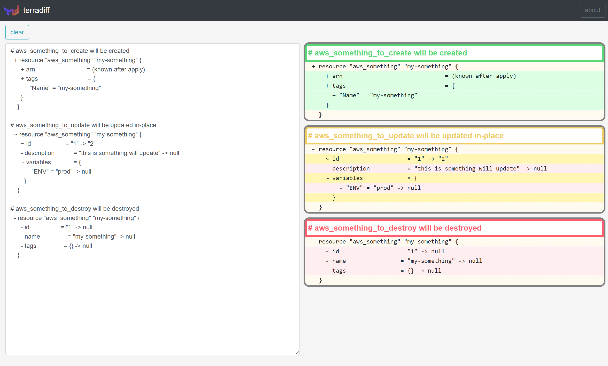

# terradiff



terradiff is a web application to check the difference of terraform apply.

It is made as app works only on the browser(Javascript).

No communication with the server is done.

No Warranty and Disclaimer makes no warranty as to the accuracy or appropriateness of contents

and result of terraform apply.

released on [maito1201.github.io/terradiff.github.io/](https://maito1201.github.io/terradiff.github.io/)

## Project setup
```
docker-compose up
```
